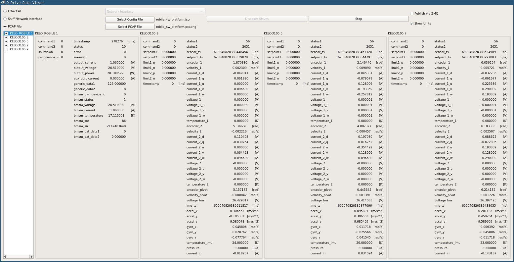
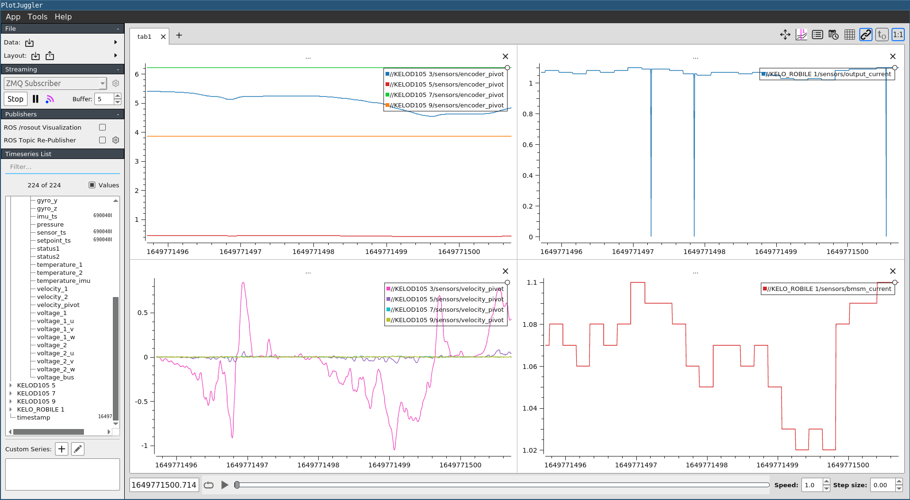

# KELO Drive Data Viewer

This program allows you to view the process data objects (PDOs) sent to and produced by [KELO drives](https://www.kelo-robotics.com/technologies/#kelo-drives), which are connected as EtherCAT slaves on a robot platform.



## Build
### Dependencies
Required:

* libtins-dev
* libjsoncpp-dev
* libzmq

One or both of the following:

* libncurses-dev
* Qt5

External sources:
* the [SOEM](https://github.com/OpenEtherCATsociety/SOEM) library is added as a git submodule
* two header files from [kelo_tulip](https://github.com/kelo-robotics/kelo_tulip) are included in the `include` folder
* the header file from [cppzmq](https://github.com/zeromq/cppzmq) which provides C++ bindings for ZMQ is included in the `include` folder

### Clone and compile
* Clone the repository with sub-modules: `git clone --recursive <repo>`
* Create a build folder: `cd <repo> && mkdir build && cd build`
* Run `cmake` with the selected options
  * `cmake ..` (build all, you will need both Qt5 and ncurses)
  * `cmake -DENABLE_QT=OFF ..` (don't build GUI)
  * `cmake -DENABLE_NCURSES=OFF ..` (don't build TUI)
* Run `make`


## Execute
* If the input source (see below) is either `ecat` or `sniffer`, you must run the executables using `sudo` or grant special permissions to the executable with, for example, `sudo setcap cap_net_raw+ep kddv-gui`.
* Run either `kddv-gui` or `kddv-tui` in the build folder
    * `kddv-gui` starts a Qt window, and therefore requires an X server
    * `kddv-tui` displays data in the terminal from a single slave at a time. Use arrow keys to move between slaves, and 'q' to quit.
* The following command line options are available for both executables; they are mandatory for `kddv-tui`:
    ```
    [--src INPUT_SOURCE]
    [--iface NETWORK_INTERFACE]
    [--config CONFIG_FILE]
    [--pcap PCAP_FILE]
    [--enable_zmq]
    [--zmq_port ZMQ_PORT]
    [--start]
    ```
* Description:
    * `src`: the source of the data
      * `ecat`: EtherCAT master
      * `sniffer`: Packet sniffer
      * `pcap`: PCAP file
    * `iface`: the network interface; to be specified if the `src` is either `ecat` or `sniffer`. Run `ip a` to list your network interfaces.
    * `config`: path to a JSON file with a configuration of the slaves; to be specified if the `src` is either `sniffer` or `pcap`
    * `pcap`: path to the PCAP file; to be specified if the `src` is `pcap`
    * `enable_zmq`: if enabled, the data will be published as a JSON string on a ZMQ socket (`tcp://*:9872`, which is the default port that [PlotJuggler](https://github.com/facontidavide/PlotJuggler) listens to)
    * `zmq_port`: port for the ZMQ socket (optional, default: 9872)
    * `start`: start reading the data immediately (optional, not available for `kddv-tui`)

* Examples:
  * `./kddv-tui --src ecat --iface enp2s0 --enable_zmq`
  * `./kddv-gui --src pcap --config ../config/robile.json --pcap ../data/robile.pcapng`

## Sources
### EtherCAT master
Use `ecat` as the source if you have no other EtherCAT masters running on the system. In this case, you need to run this program on the robot, which has one of its network interfaces connected to the EtherCAT hub to which all the slaves are connected. The EtherCAT master sets all slaves into `SAFE_OP` mode, and sends and receives process data. The RX PDOs are not modified (set to 0), therefore no commands are sent to the drives. The TX PDOs are parsed and displayed. Therefore, use this mode if you only want to read the sensors/outputs from the slaves, without actually controlling them.

### Packet sniffer
Use `sniffer` as the source if there is already an EtherCAT master running on the robot. You still need to run this program on the robot, since it needs access to the network interface used for EtherCAT communication. In this mode, the network packets are sniffed (using the [libtins](http://libtins.github.io/) library), and parsed if they contain PDOs.


The parsing requires prior knowledge of the topology of the EtherCAT slaves, and the sizes of their data structures. This must be specified in a config file in the JSON format. Use the `generate_config_file` executable to generate this config file for a particular robot / EtherCAT topology. The sniffer will not work correctly if the topology or data structures do not match the config file (i.e. the data displayed will be incorrect).


See the format of an EtherCAT packet [here](https://www.ethercat.org/en/technology.html#1.2) and [here](https://infosys.beckhoff.com/english.php?content=../content/1033/tc3_io_intro/1257993099.html&id=). The `RX start offset` and `TX start offset` fields specify the location in the datagram where the PDOs for each slave starts. The size is determined from the size of the struct (e.g. in KeloDriveAPI.h).


One way to check that the data you are getting is incorrect is if none of the `accel_*` variables are ~10 m/s/s. Similarly if `voltage_bus` is not 24-26 V (the battery voltage), the data is probably parsed incorrectly. Since another EtherCAT master is running, and presumably controlling the robot, the RX PDOs will also be read and parsed - therefore you can use this mode when you want to read both the commands to the slaves (RX) and the sensed values from the slaves (TX).

### PCAP file
Use `pcap` as the source if you have recorded a PCAP file previously on the robot. Since access to the EtherCAT network interface is not required, it is not necessary to run this on the robot. Similar to the `sniffer` mode, the slave topology and data structure sizes need to be known beforehand and specified in a config file. This is the preferred way to view the data if you want to view *all* of the data sent and received. With the `sniffer` mode, it is possible that some packets are missed. This would be particularly relevant, when, for example, examining the emergency stop signals, which may toggle on and off within two cycles.


You can record a PCAP file with [tshark](https://tshark.dev/setup/install/):

```
sudo tshark -i <network interface> -w output.pcapng
```

Note that the recorded file can get quite large (e.g. 24 MB for 11 seconds).


You can also play back the recorded file using [tcpreplay](https://linux.die.net/man/1/tcpreplay) on the loopback interface, and use the `sniffer` mode to view the data, though there is no real reason to do this:

```
sudo tcpreplay -i lo output.pcapng
./kddv-gui --src sniffer --iface lo --config ../path/to/config.json --start
```

## Config file
A config file in JSON format is required if you run this program in `sniffer` or `pcap` mode. The config file lists the EtherCAT slaves with information such as their name, position in the slave topology, location of the PDOs in the EtherCAT datagram, etc.


To generate the config file for a robot, connect one of your network interfaces to the EtherCAT hub, and run:

```
./generate_config_file <network interface> <path to config file>
```


Run with sudo, or set capabilities for raw network access as described under [Execute](#execute).

## Slave types
Currently three types of EtherCAT slaves are supported: KELO Drive (identified by the name "KELOD105" (current) or "SWMC" (old)), the [Robile](https://www.kelo-robotics.com/products/#rapid-prototyping) battery management module (identified by the name "KELO_ROBILE"), and the EtherCAT coupler/Power distribution board on our dual-arm robot (identified by the name "KeloEcPd").
The header files with the definitions of the RX and TX PDOs for the first two slaves were obtained from the [kelo_tulip](https://github.com/kelo-robotics/kelo_tulip) repository. See [KeloDriveAPI.h](include/KeloDriveAPI.h) and [RobileMasterBattery.h](include/RobileMasterBattery.h).
More slave types can be added by implementing the `EthercatSlave` interface.

## ZMQ publisher
[PlotJuggler](https://github.com/facontidavide/PlotJuggler) is a nice tool for plotting time-series data. It has a ZMQ plugin which subscribes to a ZMQ socket, and is able to parse data in JSON format. Therefore this program includes a ZMQ publisher to optionally publish the data to a ZMQ socket.


